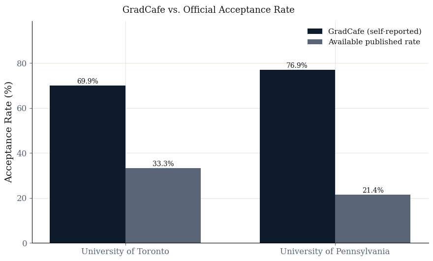

# Crowdsourced Graduate Admissions Data: Patterns, Biases, and Predictive Limits

This repository holds my final project for a cs course at the University of Toronto.

<div align="center">
    
</div>

This project examines whether self-reported graduate admissions data from TheGradCafe can meaningfully characterize admission dynamics at the University of Toronto and the University of Pennsylvania. The corresponding functions scrape, clean, and store the data in a normalized SQLite database, run seven SQL queries to characterize GPA distributions, acceptance rates by GPA range, and the association between GRE reporting and outcomes, and compare the platform's implied acceptance rates against official institutional figures compiled from public sources. A binary logistic regression is then trained to show that GPA and GRE together produce AUC of 0.5878 at UofT and 0.7008 at UPenn, confirming that quantitative metrics carry modest signal but cannot reliably predict individual outcomes. The gap between GradCafe's implied acceptance rates and official figures is the most practically significant finding.

## Project Contents

```
PROJECT/
├── config.py                                   - Global variables, typography settings, color palettes, and official admission rates.
├── data_processing.py                          - Pandas code to clean raw scraped data, parse regex features, and handle NaNs.
├── database.py                                 - SQLite schema creation, data insertion, and SQL queries.
├── plotting.py                                 - Matplotlib and Seaborn visualization functions for all charts and figures.
├── predictive_modeling.py                      - Logistic regression setup, Saerens prior adjustments, and associated plots.
├── scraper.py                                  - Cloudscraper and BeautifulSoup code to scrape applicant records from GradCafe.
├── document.pdf                                - pdf version of the jupyter notebook (generated with pandoc)
├── index.ipynb                                 - Primary Research Notebook.
├── web_scraping.ipynb                          - Notebook demonstrating Web scraping process.
├── uoft_all_masters_decisions.csv              - Raw scraped dataset of UofT Master's program decisions.
├── uoft_published_graduate_admissions_data.csv - Official benchmark dataset for UofT.
├── upenn_all_masters_decisions.csv             - Raw scraped dataset of UPenn Master's program decisions.
└── upenn_publicly_av_masters_admissions.csv    - Official benchmark dataset for UPenn.
```
